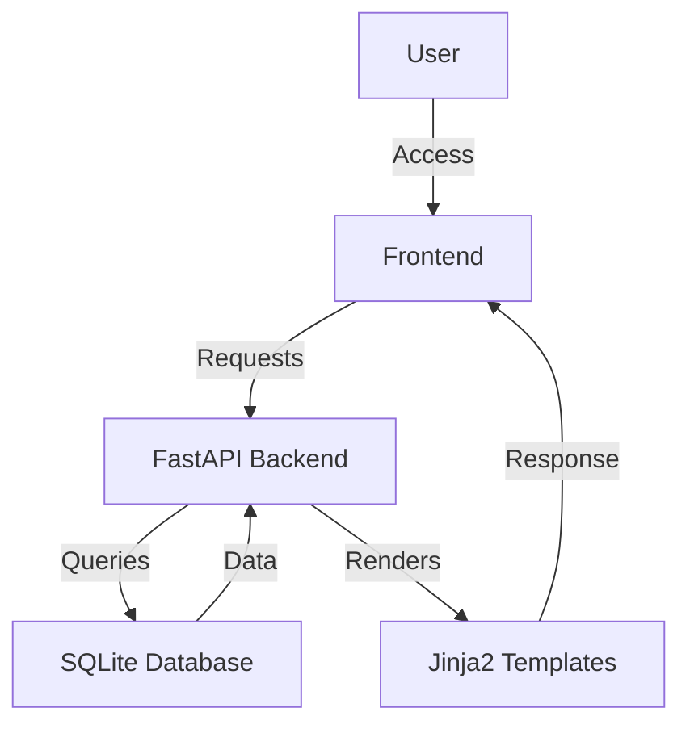

# AI-Powered Healthcare Diagnosis Assistant

## Overview
The AI-Powered Healthcare Diagnosis Assistant is an innovative application designed to assist healthcare professionals in diagnosing patient conditions more efficiently. Utilizing AI-driven technology, this application analyzes patient symptoms and medical history to provide potential diagnosis suggestions. It aims to streamline the diagnostic process, reduce human error, and enhance patient care by offering data-driven insights. This tool is particularly beneficial for healthcare providers, clinics, and hospitals seeking to integrate AI into their diagnostic workflows, ultimately improving decision-making and patient outcomes.

## Features
- **AI-Driven Diagnosis**: Leverages AI algorithms to suggest possible diagnoses based on patient symptoms and medical history.
- **Patient Management**: Allows healthcare providers to add, view, and manage patient records efficiently.
- **Secure Authentication**: Includes a login system to ensure that only authorized personnel can access sensitive patient data.
- **Responsive Design**: A user-friendly interface that adapts to various devices, ensuring accessibility for healthcare professionals on-the-go.
- **Data Visualization**: Presents patient data and diagnosis results in a clear, concise manner for easy interpretation.
- **Dynamic Content Loading**: Fetches and displays patient data dynamically without requiring page reloads.

## Tech Stack
| Technology   | Description                              |
|--------------|------------------------------------------|
| Python       | Programming language for backend logic   |
| FastAPI      | Web framework for building the API       |
| Uvicorn      | ASGI server for running FastAPI apps     |
| SQLAlchemy   | ORM for database interactions            |
| Jinja2       | Templating engine for rendering HTML     |
| Pydantic     | Data validation and settings management  |
| SQLite       | Database for storing patient and diagnosis data |
| HTML/CSS     | Frontend structure and styling           |
| JavaScript   | Client-side scripting for interactivity  |

## Architecture
The project follows a typical MVC architecture where the FastAPI backend serves the frontend templates rendered by Jinja2. The application consists of several API endpoints that interact with a SQLite database to manage patient and diagnosis data.



## Getting Started

### Prerequisites
- Python 3.11+
- pip (Python package installer)

### Installation
1. Clone the repository:
   ```bash
   git clone https://github.com/yourusername/ai-powered-healthcare-diagnosis-assistant-auto.git
   cd ai-powered-healthcare-diagnosis-assistant-auto
   ```
2. Create and activate a virtual environment:
   ```bash
   python -m venv venv
   source venv/bin/activate  # On Windows use `venv\Scripts\activate`
   ```
3. Install the dependencies:
   ```bash
   pip install -r requirements.txt
   ```

### Running the Application
1. Start the application:
   ```bash
   uvicorn app:app --reload
   ```
2. Visit the application in your browser at `http://localhost:8000`

## API Endpoints
| Method | Path                 | Description                                    |
|--------|----------------------|------------------------------------------------|
| GET    | `/`                  | Render the home page                           |
| GET    | `/login`             | Render the login page                          |
| GET    | `/dashboard`         | Render the dashboard page                      |
| GET    | `/patient/{id}`      | Render patient details page                    |
| GET    | `/about`             | Render the about page                          |
| GET    | `/api/patients`      | Retrieve a list of all patients                |
| POST   | `/api/diagnosis`     | Create a new diagnosis entry                   |
| GET    | `/api/patient/{id}`  | Retrieve details of a specific patient         |
| POST   | `/api/login`         | Authenticate a user and provide a token        |

## Project Structure
```
.
├── app.py                  # Main application file with FastAPI setup
├── Dockerfile              # Docker configuration for containerization
├── requirements.txt        # Python dependencies
├── start.sh                # Shell script for starting the application
├── static/
│   ├── css/
│   │   └── style.css       # Stylesheet for frontend styling
│   └── js/
│       └── main.js         # JavaScript for client-side interactions
├── templates/
│   ├── about.html          # About page template
│   ├── dashboard.html      # Dashboard page template
│   ├── home.html           # Home page template
│   ├── login.html          # Login page template
│   └── patient_details.html # Patient details page template
```

## Screenshots
*Screenshots of the application interface will be added here.*

## Docker Deployment
1. Build the Docker image:
   ```bash
   docker build -t ai-healthcare-assistant .
   ```
2. Run the Docker container:
   ```bash
   docker run -p 8000:8000 ai-healthcare-assistant
   ```

## Contributing
Contributions are welcome! Please fork the repository and submit a pull request for review.

## License
This project is licensed under the MIT License.

---
Built with Python and FastAPI.